# TECTON Development History

This document records how TECTON evolved from a Three.js seismic-viewer idea into a GitHub-ready frontend/backend monorepo. It is organized chronologically and uses **Why / How / What** for each major decision so the repository can be studied as an engineering process, not only as finished code.

Development covered 7–8 August 2026. The current repository version is `0.2.0`.

## 1. Original problem

### Why

Seismic catalogs are difficult to understand as flat tables. Analysts need to inspect longitude, latitude, depth, magnitude, time, faults, and stations as one linked spatial system. ParaView was the interaction reference because it separates datasets, layers, properties, views, selections, and time controls instead of presenting visualization as a single chart.

### How

The initial direction was a browser application using:

- React and TypeScript for application state and UI.
- Three.js for GPU rendering, picking, cameras, and scene layers.
- Vite for fast local development and production builds.
- A deterministic synthetic Taiwan-region catalog so interaction could be developed before connecting an authoritative service.

The first implementation was intentionally frontend-only. This reduced architecture risk while the interaction model was still changing.

### What

The first project folder became `seismic-3d-viewer`. Its initial capabilities included:

- A local east/north/depth seismic volume.
- Instanced event glyphs.
- Perspective, top, east, and north camera presets.
- Orbit controls and event picking.
- Fault, station, surface, and hypocenter layers.
- Magnitude, depth, time, and text filters.
- CSV import and export.
- Timeline playback.

The production scene remains in [`frontend/src/features/seismic-viewer/components/SceneViewport.tsx`](frontend/src/features/seismic-viewer/components/SceneViewport.tsx).

## 2. Initial 3D rendering design

### Why

Rendering one Three.js mesh per earthquake would create too many JavaScript objects and draw calls. The application needed to remain interactive as the catalog grew.

### How

The renderer uses `THREE.InstancedMesh`. A shared sphere geometry and material are reused while each instance receives its own transform and color. A raycaster maps `instanceId` back to the corresponding seismic event.

Geographic coordinates are converted to a local approximation:

```text
x = (longitude - originLongitude) × kmPerLongitude
y = -depthKm × verticalExaggeration
z = -(latitude - originLatitude) × kmPerLatitude
```

At the Taiwan-region origin:

```text
kmPerLatitude  = 111.32
kmPerLongitude = 111.32 × cos(originLatitude)
```

### What

This produced a fast interactive volume without requiring a server. It also established an important architectural boundary: React owns application state, while Three.js owns the continuously rendered scene.

## 3. Scalar coloring and color tables

### Why

One fixed color scheme cannot explain every scientific question. Depth, magnitude, and event recency need different scalar interpretations, and analysts expect selectable transfer functions similar to ParaView.

### How

A shared palette module was created with Inferno, Viridis, Cividis, Ice–Fire, and Grayscale tables. Scalar values are normalized into the range `0..1`, then interpolated between color stops.

The same color calculation is used by:

- The 3D instanced glyphs.
- Map events.
- Profile-section events.
- The appearance-panel preview.
- The 3D viewport color bar.

### What

The relevant implementation is in [`palette.ts`](frontend/src/features/seismic-viewer/model/palette.ts). The color-table dropdown and scalar-field selector are linked to one `ViewSettings` state object.

## 4. ParaView-inspired UI redesign

### Why

The early interface exposed functionality but did not clearly communicate the difference between data, visualization layers, filters, appearance, analysis, selection, and time. As tools accumulated, a conventional dashboard layout would become crowded.

### How

The UI was redesigned as a dense scientific workstation:

- A command bar for dataset identity, commands, runtime state, import, export, and capture.
- A narrow tool rail for Data, Layers, Filters, Appearance, and Analysis.
- A contextual panel whose contents change with the selected tool.
- Workspace tabs for 3D Volume, Map, Section, and Table.
- A conditional event inspector.
- A docked timeline and status bar.
- A keyboard command palette using `Cmd/Ctrl + K`.

The visual direction is intentionally utilitarian rather than a generic card dashboard. Monospaced labels, strict grid boundaries, low-radius controls, amber focus states, and restrained texture make it resemble an analysis instrument.

### What

The application shell and linked views are implemented in [`SeismicWorkspace.tsx`](frontend/src/features/seismic-viewer/components/SeismicWorkspace.tsx), with the visual system in [`styles.css`](frontend/src/assets/styles.css).

## 5. Linked map profile and depth section

### Why

A regional west–east section is useful for orientation but cannot answer arbitrary geological questions. Analysts need to draw an A–A′ trace across a structure and inspect only events inside a selected corridor.

### How

The Map workspace received a pointer-driven profile tool:

1. Select **Draw profile**.
2. Drag from A to A′.
3. Set the corridor width in kilometers.
4. Open the linked Section view.

For each event, the application calculates its position relative to the trace. Longitude differences are scaled by the cosine of mean latitude.

```text
segment = (segmentEast, segmentNorth)
event   = (eventEast, eventNorth)

fraction = dot(event, segment) / |segment|²
alongKm  = fraction × |segment|
offsetKm = |eventEast × segmentNorth - eventNorth × segmentEast| / |segment|
```

An event is included when:

```text
0 ≤ fraction ≤ 1
offsetKm ≤ corridorWidthKm / 2
```

### What

- [`profile.ts`](frontend/src/features/seismic-viewer/model/profile.ts) contains the reusable browser geometry.
- The Map view displays the corridor, center line, endpoints, length, width, and event count.
- The Section view changes its horizontal axis from longitude to distance from A.
- Corridor width was first offered as fixed choices, then upgraded to a validated `1–500 km` numeric input.

## 6. Contrast, gray theme, and 3D legend

### Why

The original near-black/green surfaces reduced separation between panels, grids, and scientific overlays. Event color tables needed to remain the strongest colors in the interface.

### How

Large surfaces were moved to a neutral graphite-gray system. Gray values now establish hierarchy, while amber is reserved for focus, active tools, and profile traces. The Three.js background, fog, surface plane, and grid were adjusted to the same family.

A compact 3D color bar was placed directly over the viewport. It reads the same state as the appearance controls and displays:

- Active scalar variable.
- Active color table.
- Minimum and maximum labels.
- The exact transfer-function gradient.

### What

The map, section, table, command bar, panels, Three.js scene, and viewport legend now use a consistent neutral background. This improved contrast without changing scientific data colors.

## 7. Performance analysis and backend selection

### Why

The browser-only model is appropriate for thousands or hundreds of thousands of events, but it becomes inefficient when catalogs reach millions of rows. JSON also repeats field names and converts compact numerical columns into expensive JavaScript objects.

### How

Several scale tiers were considered:

| Scale | Preferred approach |
| --- | --- |
| Up to roughly 500k events | Browser filtering, typed arrays, workers, instancing |
| Roughly 500k–10M events | FastAPI, DuckDB/Polars, Parquet, Arrow IPC |
| More than 10M or high-rate streaming | Profile measured hot paths; consider Rust selectively |

Python was selected before Rust because the heavy work can already run inside native vectorized engines:

- Polars handles ingestion and dataframe transformations.
- DuckDB executes analytical SQL and pushes filters into Parquet scans.
- PyArrow serializes columnar record batches.
- FastAPI handles validation, routing, CORS, and streaming responses.

Rust remains a later optimization, not an initial architectural requirement.

### What

The design was recorded in [`BACKEND_PERFORMANCE_PLAN.md`](BACKEND_PERFORMANCE_PLAN.md), including performance budgets, API contracts, storage decisions, and scale gates.

## 8. Why Polars and DuckDB both exist

### Why

Polars and DuckDB overlap, but their strongest roles differ in this project. Forcing every workload into one engine would make either ingestion or interactive querying less natural.

### How

Responsibilities were separated:

- **Polars:** CSV schema inspection, renaming, type conversion, missing-value removal, timestamp normalization, derived partition fields, sorting, and normalized Parquet output.
- **DuckDB:** bounding-box filters, time/magnitude/depth filters, projection queries, statistics, map aggregation, and Parquet partition scanning.

The ingestion path first writes normalized Parquet with Polars, then uses DuckDB `COPY ... PARTITION_BY (year, month)` to create the catalog layout.

### What

The ingestion command is:

```bash
python -m backend.app.cli.ingest earthquakes.csv taiwan-regional
```

Its implementation is in [`backend/app/cli/ingest.py`](backend/app/cli/ingest.py).

## 9. FastAPI data service

### Why

The frontend needs bounded, validated, cancelable requests instead of downloading every event. It also needs a transport that preserves numerical columns.

### How

FastAPI provides the HTTP boundary and CORS configuration. CPU-bound DuckDB operations are kept outside normal async request logic, and results are serialized as Arrow IPC record batches.

Implemented endpoints:

```text
GET  /api/v1/health
GET  /api/v1/catalogs
GET  /api/v1/catalogs/{catalog_id}/events
POST /api/v1/catalogs/{catalog_id}/profiles
GET  /api/v1/catalogs/{catalog_id}/tiles/{zoom}/{x}/{y}
GET  /api/v1/catalogs/{catalog_id}/stats
```

The service applies maximum row limits and validates profile geometry. Event queries are parameterized. Catalog identifiers are restricted before they are converted into filesystem paths.

At lower tile zoom levels, the API returns aggregated cells. At higher zoom levels, it returns raw events. Responses include ETags and LOD metadata.

### What

- Application setup and CORS: [`backend/app/main.py`](backend/app/main.py)
- API routes: [`backend/app/api/routes/catalogs.py`](backend/app/api/routes/catalogs.py)
- DuckDB queries: [`backend/app/repositories/catalogs.py`](backend/app/repositories/catalogs.py)
- Arrow serialization: [`backend/app/services/arrow_stream.py`](backend/app/services/arrow_stream.py)
- Pydantic contracts: [`backend/app/schemas/catalog.py`](backend/app/schemas/catalog.py)

## 10. Arrow browser path

### Why

Parsing a very large JSON array on the browser main thread can block input and create excessive garbage-collection pressure.

### How

The frontend data client requests `application/vnd.apache.arrow.stream`. An Arrow worker decodes numerical columns into typed arrays and transfers their underlying buffers instead of copying them.

The current imperative viewer still uses its local synthetic data by default. The Arrow service is the integration layer for switching to server-backed catalogs without coupling networking to the renderer.

### What

- API client: [`seismicApi.ts`](frontend/src/features/seismic-viewer/services/seismicApi.ts)
- Worker client: [`arrowWorkerClient.ts`](frontend/src/features/seismic-viewer/services/arrowWorkerClient.ts)
- Worker decoder: [`arrowDecode.worker.ts`](frontend/src/features/seismic-viewer/workers/arrowDecode.worker.ts)

## 11. React Three Fiber migration strategy

### Why

React Three Fiber and Drei improve declarative composition and make future 3D layers easier to divide into React components. Rewriting the already-working renderer in one step would create unnecessary regression and performance risk.

### How

The project keeps two paths:

- `SceneViewport.tsx`: current production renderer, optimized and verified.
- `Canvas.tsx`: React Three Fiber foundation with camera, lights, grid, orbit controls, and optional statistics.

Future work can migrate surface, fault, station, and event layers one at a time while comparing behavior and performance with the original scene.

### What

The R3F foundation is in [`Canvas.tsx`](frontend/src/features/seismic-viewer/components/Canvas.tsx). Zustand state was introduced in [`viewerStore.ts`](frontend/src/features/seismic-viewer/store/viewerStore.ts) for future declarative camera/view coordination.

## 12. Monorepo reorganization

### Why

Once the backend existed, the original frontend-only root structure no longer described system boundaries. The frontend also needed feature ownership rather than an expanding flat `src` directory.

### How

The repository was reorganized into a workspace:

```text
repository/
├── backend/
├── frontend/
├── scripts/
├── docs/
├── .github/
├── package.json
└── Makefile
```

Frontend code was grouped under:

```text
frontend/src/features/seismic-viewer/
├── components/
├── hooks/
├── model/
├── services/
├── store/
└── workers/
```

The existing application was moved rather than recreated, preserving the user's working viewer and accumulated UI changes.

### What

The root `package.json` now coordinates the frontend workspace and cross-project scripts. The root [`README.md`](README.md) documents the current layout and commands.

## 13. One-command development workflow

### Why

Requiring contributors to remember separate working directories, ports, virtual-environment paths, and server commands causes inconsistent setup and slows onboarding.

### How

Portable Bash wrappers were added without requiring an extra Node process manager:

```bash
npm run setup          # npm install + Python venv + pip install
npm run dev            # backend and frontend together
npm run dev:backend    # backend only
npm run dev:frontend   # frontend only
npm run check          # available build, type, Python, test, and shell checks
```

`scripts/dev.sh all` launches both processes, records their PIDs, installs signal traps, and stops the remaining process if either service exits.

### What

- Setup: [`scripts/setup.sh`](scripts/setup.sh)
- Development runner: [`scripts/dev.sh`](scripts/dev.sh)
- Aggregate validation: [`scripts/check.sh`](scripts/check.sh)
- Make alternatives: [`Makefile`](Makefile)

## 14. Reusable scaffold script

### Why

The requested architecture should be reproducible without manually creating dozens of directories and placeholder files.

### How

An idempotent shell script creates backend, frontend, feature, GitHub, documentation, and script locations. It uses `mkdir -p` and `touch`, so running it again does not erase file contents.

### What

```bash
./scripts/scaffold_project.sh my-project
```

The implementation is in [`scripts/scaffold_project.sh`](scripts/scaffold_project.sh). It was tested against a temporary directory and successfully produced the expected tree.

## 15. GitHub publication preparation

### Why

A codebase is not ready for collaboration only because it builds. Public repositories need contribution rules, automated validation, issue intake, security reporting, dependency maintenance, and release guidance.

### How

The following repository surface was added:

- Frontend and backend GitHub Actions jobs.
- Dependabot configuration for npm, pip, and GitHub Actions.
- Structured bug and feature issue forms.
- Pull-request checklist.
- Contributing and security policies.
- Community standards.
- Changelog.
- Architecture documentation.
- Publishing checklist.
- EditorConfig and Git attributes.

No open-source license was selected automatically because that is a legal/product-owner decision. The publishing checklist makes this an explicit release gate.

### What

See [`.github/`](.github/), [`CONTRIBUTING.md`](CONTRIBUTING.md), [`SECURITY.md`](SECURITY.md), [`CHANGELOG.md`](CHANGELOG.md), and [`docs/publishing-checklist.md`](docs/publishing-checklist.md).

## 16. Validation history

### Why

Every structural change risked breaking imports, build paths, scripts, or Python syntax. Verification was performed after each material phase rather than only at the end.

### How

Checks used during development included:

```bash
npm run build
PYTHONPYCACHEPREFIX=/tmp/tecton-pycache python3 -m compileall -q backend
bash -n scripts/setup.sh scripts/dev.sh scripts/check.sh scripts/scaffold_project.sh
./scripts/scaffold_project.sh /tmp/tecton-scaffold-check
npm run check
```

### What

Current verified state:

- Core frontend TypeScript and Vite production build: passing.
- Python source compilation: passing.
- Bash syntax: passing.
- Scaffold creation: passing.
- Dependency-aware aggregate `npm run check`: passing.
- Production bundle: approximately `794 kB` JavaScript before gzip and approximately `213 kB` after gzip.

The build still reports a chunk-size warning. The next frontend performance task should lazy-load the 3D workspace or separate Three.js into its own chunk.

## 17. Environment limitation encountered

### Why it mattered

The monorepo introduced new dependencies: React Three Fiber, Drei, Apache Arrow JavaScript, Zustand, FastAPI, Polars, DuckDB, PyArrow, and Pydantic Settings.

### What happened

The development sandbox could not access the npm or Python package registries. `npm install` waited without progress and was terminated. The system Python also did not have the new backend packages installed.

### How the project handled it

- Dependencies were declared in `frontend/package.json`, `backend/requirements.txt`, and `backend/pyproject.toml`.
- The existing frontend build remained verifiable with already-installed dependencies.
- Registry-dependent integration files received a separate `tsconfig.integrations.json` check.
- `scripts/check.sh` runs full integration tests when dependencies exist and safe syntax/build fallbacks when they do not.
- The stale pre-monorepo `package-lock.json` was removed; `npm run setup` will generate a correct workspace lockfile in a networked environment.

This distinction is important: the source architecture is implemented, but the FastAPI runtime and new R3F/Arrow dependency types must still be exercised after installation.

## 18. Architectural decisions and tradeoffs

| Decision | Why | Tradeoff |
| --- | --- | --- |
| Keep imperative Three.js renderer | Already fast and working | Two rendering approaches temporarily coexist |
| Add R3F incrementally | Better future composition | Migration is not yet complete |
| Use synthetic catalog initially | UI can develop without external dependency | Not valid for scientific conclusions |
| Use InstancedMesh | Low draw-call/object overhead | Per-event styling must use instance buffers |
| Use approximate local projection | Sufficient for regional visualization | Not a replacement for a geodetic library at larger extents |
| Use Polars for ingestion | Vectorized normalization and streaming writes | Another engine to understand |
| Use DuckDB for queries | Excellent SQL and Parquet pushdown | Per-request connection strategy needs load testing |
| Use Arrow IPC | Compact columnar transport | Browser requires Arrow dependency and worker path |
| Avoid an ORM | Event data is analytical and append-oriented | Mutable user data will need a separate store later |
| Delay Rust | Avoid premature complexity | Very high-rate hot paths may still require it later |
| Do not choose a license automatically | Licensing is an owner decision | Repository needs one more step before open-source release |

## 19. Current data flow

```mermaid
flowchart LR
  CSV["CSV seismic catalog"] --> POLARS["Polars normalization"]
  POLARS --> PARQUET["Year/month Parquet partitions"]
  PARQUET --> DUCKDB["DuckDB filters, profiles, tiles"]
  DUCKDB --> ARROW["Arrow IPC record batches"]
  ARROW --> FASTAPI["FastAPI streaming response"]
  FASTAPI --> WORKER["Browser Arrow Web Worker"]
  WORKER --> ARRAYS["Transferable typed arrays"]
  ARRAYS --> VIEWER["React + Three.js workspace"]
```



## 20. Recommended reading order

To learn the codebase efficiently:

1. [`README.md`](README.md) — commands and repository map.
2. [`docs/architecture.md`](docs/architecture.md) — system boundaries.
3. [`frontend/src/features/seismic-viewer/model/types.ts`](frontend/src/features/seismic-viewer/model/types.ts) — frontend domain model.
4. [`SeismicWorkspace.tsx`](frontend/src/features/seismic-viewer/components/SeismicWorkspace.tsx) — state and UI composition.
5. [`SceneViewport.tsx`](frontend/src/features/seismic-viewer/components/SceneViewport.tsx) — rendering and picking.
6. [`profile.ts`](frontend/src/features/seismic-viewer/model/profile.ts) — profile mathematics.
7. [`backend/app/cli/ingest.py`](backend/app/cli/ingest.py) — source-to-Parquet path.
8. [`backend/app/repositories/catalogs.py`](backend/app/repositories/catalogs.py) — analytical SQL.
9. [`backend/app/api/routes/catalogs.py`](backend/app/api/routes/catalogs.py) — HTTP boundary.
10. [`BACKEND_PERFORMANCE_PLAN.md`](BACKEND_PERFORMANCE_PLAN.md) — future scale decisions.

## 21. Reproducing the project from a clean clone

```bash
git clone <repository-url>
cd seismic-3d-viewer
npm run setup
npm run check
npm run dev
```

Prepare a catalog:

```bash
python -m backend.app.cli.ingest earthquakes.csv taiwan-regional
```

Then open:

- Frontend: `http://127.0.0.1:4173`
- FastAPI documentation: `http://127.0.0.1:8000/docs`

## 22. Remaining work

The following tasks are intentionally unfinished or require a networked/production environment:

1. Run `npm run setup` and commit the generated `package-lock.json`.
2. Run `npm run check:integrations` with R3F, Drei, Arrow, and Zustand installed.
3. Execute backend unit/API tests with FastAPI, Polars, DuckDB, and PyArrow installed.
4. Ingest a representative catalog and benchmark 100k, 1M, and 10M events.
5. Connect the visible workspace data source to the backend catalog selector.
6. Add request cancellation, query caching, and viewport debouncing to the active UI path.
7. Code-split or lazy-load Three.js to remove the large initial bundle warning.
8. Decide whether the imperative renderer or R3F becomes the long-term primary renderer.
9. Select a license and complete the publishing checklist.
10. Replace demonstration data with an authoritative catalog before scientific use.

## 23. Main lessons

### Why first

The most successful decisions began with the analysis task: linked spatial views, arbitrary profiles, and scalable catalog filtering. Technology choices followed those needs.

### How second

The project reduced risk by evolving in layers: working browser prototype, improved interaction, shared visualization state, profile mathematics, performance plan, backend, monorepo, then publication tooling.

### What last

Each phase produced a usable artifact rather than only a plan: a working viewer, a linked profile tool, a real columnar API implementation, reproducible scripts, and repository governance files.

The central engineering principle is: **preserve a working vertical slice while moving expensive work toward columnar, vectorized, and asynchronous boundaries.**
